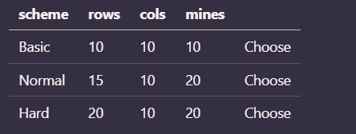

# MineSweeper_Python


## Overview 


flow game : main menu -> select `play`-> select `option` -> play game -> after win/lose select (`Again` / `Quit`)
    + 'Again'` -> mainmenu

## Stuctures for gameplay
<pre>
├── main.py # Chạy code 
└── Scripts
    ├── board.py # Tạo ma trận
    ├── game.py  # game manager minesweeper
    ├── piece.py # Đánh xung quanh chỗ có bom, (tạo phần tử cho mảng)
    └── Solver.py # Move , flag (cờ)
└── music
└── images
</pre>

## Requirements
```bash
python -m pip install pygame
```
`blabla thieeus j install do nhen`

## Boards

| scheme       | rows   | cols   | mines   |      |
| ------------ | ------ | ------ | ------- |------|
| Basic        | 10     | 10     | 10      |Choose
| Normal | 15   | 10    | 20      |Choose|
| Hard      | 20     | 10     | 20      | Choose


## Features
### 1. Use

- Game check chính xác các ô có mìn 
- Gắn được cờ khi ấn chuột phải 
- Ô đang set mặc định (12x12) với 10% bom
- Cấu trúc tổ chức file : run file `main.py` để hiển thị màn hình 
    - File `board.py` : khởi tạo bảnng chơi, check game win
    - File `game.py` : code UI (picture, music, stage etc)
    - file `piece.py`: các thông số thay đổi khi chơi game
    - file `solver.py`: di chuyển chuột

### 2. Need to code
- Multiple Screens on PyGame -> code `main menu` có 3 option
    - Play , Tutorial -> Quit 
- Code menu `option `: có 3 mức basic, hard, normal (code giống dị ấn choose -> chuyển đến gameplay)
    
- Nhạc khi chơi game (general music & lose game)
- Sau khi làm xong Dung sẽ export ra application `auto-py-to-exe`

=> Done 

### 3. UI (Need to fix)

### 4.EXport 

```
    pyinstaller main.py --onefile --windowed
```

## Material
- [Python/Pygame Minesweeper Tutorial](https://www.youtube.com/watch?v=ABGtsAlXw7c) : Đây là hướng dẫn Dung tham khảo 
- [Thuật toán MineSweeper(lưu ý thuật toán xem mỗi link này được rồi nhiều nó loãng)](https://www.youtube.com/watch?v=Fjw7Lc9zlyU)
- [Pygame Tutorial for Beginners](https://www.youtube.com/watch?v=FfWpgLFMI7w)
- Tìm hiểu self : [What is the purpose of the `self` parameter? Why is it needed?](https://stackoverflow.com/questions/2709821/what-is-the-purpose-of-the-self-parameter-why-is-it-needed)
- [5 Tips To Organize Python Code](https://www.youtube.com/watch?v=e9yMYdnSlUA&t=184s)
- [HOW TO MAKE A MENU SCREEN IN PYGAME!](https://www.youtube.com/watch?v=GMBqjxcKogA&t=81s)

- [Converting Python Project (Multiple Files) to Executable (.exe) Format](https://www.youtube.com/watch?v=wp2pNVUl3lc&t=234s)
